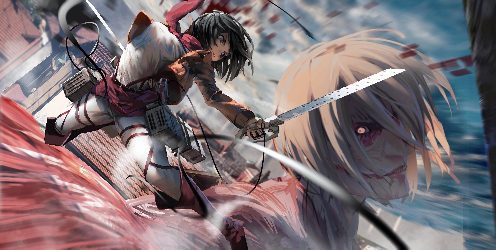

  

<h1 align="center">Hi, I'm qqbb 👋 </h1>

  <strong>C++ / Linux Developer</strong> 
  Interested in Systems Programming, Networking and AI Infrastructure.

  

<table>
<thead>
<tr>
<th align="center">About Me &amp; Awards</th>
<th align="center">Featured Projects</th>
</tr>
</thead>
<tbody>
<tr>
<td valign="top">

🎓 CS undergraduate at **Hangzhou Normal University · 2027**  
🥇 **GPLT National First Prize**  
🥈 **Zhejiang Provincial Collegiate Programming Contest Silver Medal**  
🥉 **ICPC Regional Bronze Medal**

</td>
<td valign="top">

**[MiniJudge](https://github.com/qqbb111/MiniJudge)**  
Lightweight Linux judge focused on process isolation and resource control.

**GameHall** · *WIP*  
AI-assisted multiplayer networking project with Node.js, Socket.IO and SQLite.

</td>
</tr>
</tbody>
</table>

🔭 Building C++ / Linux systems projects.  
🌱 Learning networking, OS internals and AI infrastructure; exploring CUDA / LLM inference.
